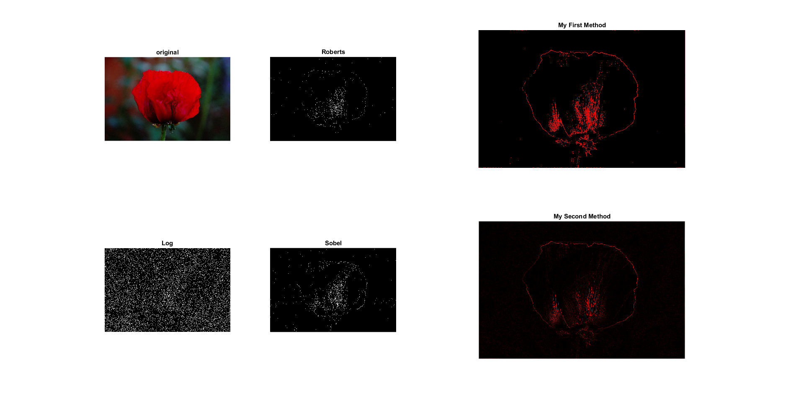

Edge-Detector
========================================
click [here](https://github.com/LainHE/Edge-Detector) go to my original project.

This project mainly aims to detect the edge of `flower.JPG`. But you could also try other images.
Because the `MethodMyself2` has many loop, it might take a while to show the result.

please check Result.png or run `Main.m` to see the results.

Here is the result below:

